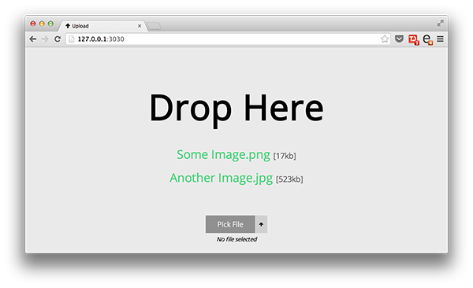

#node-upload

###Upload files to your server with Node and Express.

<p style="text-align: center; margin: auto;">

</p>

With **node-upload** you can upload images, PDFs and text files to your server by dragging and dropping. 

You can now also upload by selecting a file from your iPad or iPhone.

There's a realtime image upload overview at /overview/ it works with Socket.IO.

# How to install (for newbies)

After you've forked and cloned this repo you should cd into it and run the following commands:

```
npm install 
gulp
```

I have added gulp to watch everything so you'll never have to re-run the app, just run gulp and you're done.

You'll see 'Listening on 3030' which means you can now access the app by going to **127.0.0.1:3030**


# TODO

* Add unit tests

* Clean up client code

* Resize thumbnails for overview in /t/
